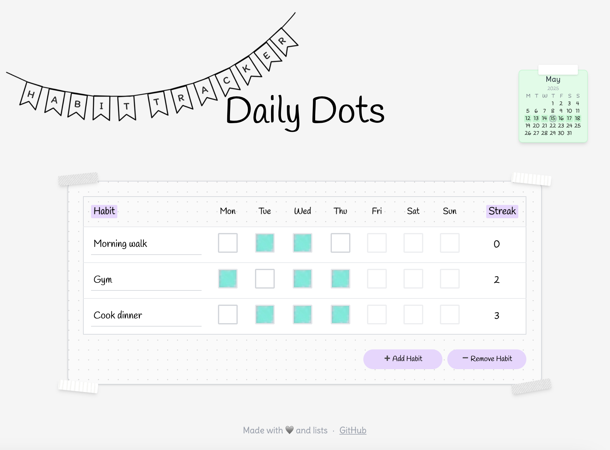

# Daily Dots

**Daily Dots** is a playful, minimalist habit tracker styled like a digital bullet journal.Track habits each week using a simple and cosy interface.
Built with React and Tailwind CSS.



---

## Features

- Track your weekly habits, up to 10 per week
- Add or remove habit rows dynamically
- Clean, minimalist UI inspired by bullet journals, with washi tape accents & bunting
- Animated scribble fill on checkboxes
- Built-in calendar with current week highlight and date circled

---

## Live Demo 

👉 [Check it out on Vercel](https://your-vercel-url.vercel.app)  
_(Update this with your actual deployment URL)_


---

## Running Locally

### 1. Clone or download the project

```bash
npm install
```

### 2. Start the development server

```bash
npm run dev
```

Your app will be running at [http://localhost:5173](http://localhost:5173)

---

## Tech Stack

- Built with **React** and **Vite** for speed and simplicity
    - [React](https://reactjs.org/)
    - [Vite](https://vitejs.dev/)
- Styled with [Tailwind CSS](https://tailwindcss.com/)

---

## License

MIT — feel free to use and adapt for your own habit-tracking needs!

---

Made with 💜 and lists.